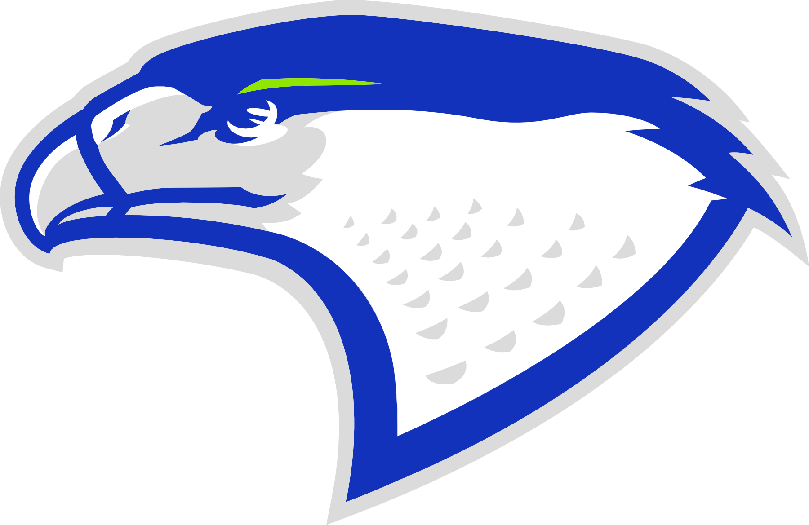

# 🦅 Lojinha Carcará — Equipe de Robótica

  

  <strong>Plataforma oficial de arrecadação para as temporadas de FIRST LEGO League (FLL) e OBR.</strong>

  
  
  

---

## 📝 **SOBRE O PROJETO**
> O site da **Lojinha Carcará** foi desenvolvido para facilitar a venda de produtos personalizados, como chaveiros e marca-páginas 3D. Todo o valor arrecadado é revertido diretamente para o financiamento de viagens, inscrições em torneios e aquisição de equipamentos para os robôs da equipe.

---

## 🚀 **FUNCIONALIDADES PRINCIPAIS**

### 🛒 **CATÁLOGO INTERATIVO**
* Exibição dinâmica de produtos com **carrossel responsivo** e fotos detalhadas.

### 🎨 **SELEÇÃO CUSTOMIZADA**
* Escolha de **cores e ajuste de quantidade** diretamente no card do produto.

### 📊 **CARRINHO EM TEMPO REAL**
* Gerenciamento de itens com **cálculo automático** do total e integração de opções de entrega.

### 📱 **INTEGRAÇÃO COM WHATSAPP**
* Finalização de pedidos via API, gerando **mensagens formatadas automaticamente** para o vendedor.

### ⚡ **DESIGN MOBILE-FIRST**
* Interface otimizada para **navegação por toque** e carregamento rápido em dispositivos móveis.

---

## 🛠️ **TECNOLOGIAS UTILIZADAS**

* `HTML5`: Estruturação semântica e acessível.
* `CSS3`: Estilização baseada na identidade visual da equipe (**Azul #081695** e **Verde #91e601**).
* `JavaScript (Vanilla)`: Lógica do carrinho, manipulação do DOM e uso de *Intersection Observer*.

---

## 🏆 **CONQUISTAS DA EQUIPE**
> Representamos **Aracaju/SE** com orgulho! Confira nossos resultados na Regional Salvador/BA (Temporada 25/26):

* 🥉 **3º Lugar Champions Award**
* 🥇 **1º Lugar Desempenho do Robô**
* 🥇 **1º Lugar Desafio do Robô**
* ✈️ **Classificados para o Torneio Nacional**

---

## 👥 **DESENVOLVEDORES**
**Projeto acadêmico e prático desenvolvido por:**

* 👤 **Larissa Cena** — [GitHub](https://github.com/laristcena)
* 👤 **Thyago Lins** — [GitHub](https://github.com/thyagolins)

---

  <em>"Transformando o futuro através da robótica e da programação." 🦅</em>

